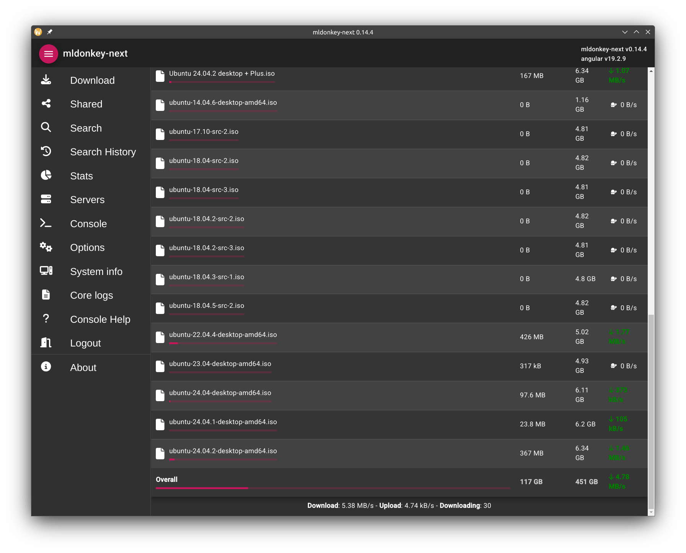
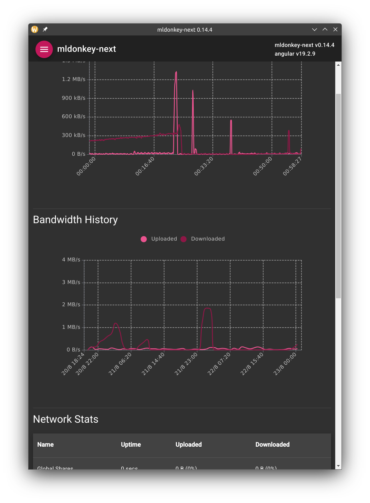

# mldonkey-next

## Table of Contents
- [Changelog](#changelog)
- [Introduction](#introduction)
- [WebApp](#webapp) (web browser app without a bridge - part of a Docker)
  - [WebApp installation](#webapp-installation)
- [NativeApp](#nativeapp) (Qt cross-platform app with a bridge - provided here in Releases)
  - [NativeApp installation](#nativeapp-installation)

## Changelog

For the full changelog, refer to [this page](https://bugfreeblog.duckdns.org/mldonkey-next).

## Introduction

mldonkey-next is a modern implementation of clients for mldonkey. mldonkey-next includes a responsive webapp and a cross-platform app (tested only on Linux and Android). mldonkey-next is in development and will not include all the features of the original webapp.

**NOTE: mldonkey-next is an experimental software. Use at your own risk!**

## WebApp

Desktop             |  Mobile
:-------------------------:|:-------------------------:
  |  
  |  

The webapp can be used in your preferred browser. It requires the installation of a bridge (named backend in the repo). The backend provides a bridge to the mldonkey core and serves the mldonkey-next webapp.

For mroe info: https://bugfreeblog.duckdns.org/2024/05/mldonkey-next.html.

### WebApp installation

mldonkey is currently a bit outdated and requires a specific setup to work properly. This is why I typically use it in docker: https://github.com/carlonluca/docker-mldonkey. mldonkey-next is provided as a dev version of that image, so you can install it by using one of the tags of that image. To choose a proper tag for your use case, refer to [this table](https://bugfreeblog.duckdns.org/docker-images-for-the-mldonkey-service). The image includes the core of mldonkey, the bridge and the webapp.

Using mldonkey-next without docker is not currently simple, but you can do it if you want.

More information on how to install mldonkey-next can be found in the docker repo: https://github.com/carlonluca/docker-mldonkey. The new mldonkey-next gui is available in the container on port 4081. The old webapp is still available on port 4080. You can use both apps, even at the same time.

## NativeApp

Desktop             |  Mobile
:-------------------------:|:-------------------------:
  |  
  |  

The native app is a Qt app embedding the webapp. The native app does not need the bridge and can connect to a generic mldonkey server. Unfortunately, a generic server is missing some patches that I only applied to my fork, so the docker image is still encouraged.

The native app is cross platform, and may work on all major platforms. However, I only tested on Linux and Android. For Android, an apk is provided for armv7, arm64, x86 and x64. For Linux, an AppImage is provided.

For more info: https://bugfreeblog.duckdns.org/2024/11/mldonkey-native-app.html.

### NativeApp installation

The AppImage and the Android app can be downloaded from the [GitHub releases](https://github.com/carlonluca/mldonkey-next/releases).

Flatpak is available in Flathub: https://flathub.org/apps/org.duckdns.bugfreeblog.mldonkeynext.

For the Android app, I suggest you use [Obtainium](https://github.com/ImranR98/Obtainium), that will also notify and update your app when a new release is uploaded.
